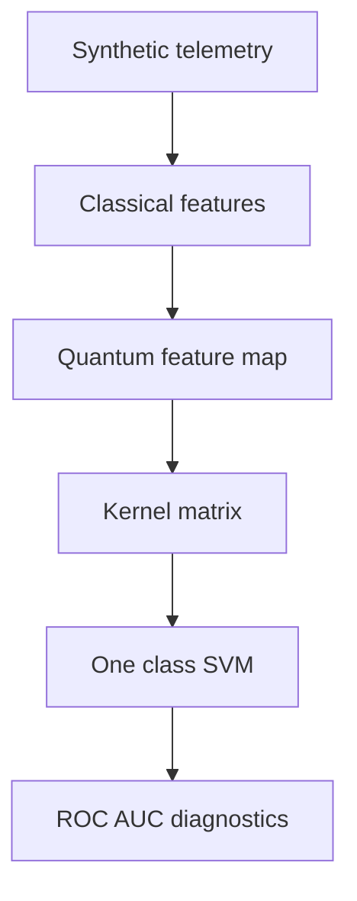

# Quantum Kernel Telemetry Anomaly Detection

*A reproducible framework for studying quantum-kernel geometry and anomaly separability in manifold-structured telemetry.*


[](https://www.python.org/downloads/)
[](https://opensource.org/licenses/MIT)
[](https://scholar.google.com/citations?user=tvwpCcgAAAAJ)
[](https://huggingface.co/Cohaerence)

[](https://x.com/coherence)
[](https://www.christopheraltman.com)
[](https://www.linkedin.com/in/Altman)
<!-- [](https://doi.org/10.5281/zenodo.XXXXXXX) -->


---

## Overview

This repository implements and evaluates quantum kernel methods for anomaly detection in telemetry regimes where nominal system behavior lies on a low-dimensional, curved manifold embedded in a high-dimensional observation space. Such regimes are characteristic of spacecraft, aerospace, and other tightly coupled dynamical systems, where anomalies correspond to structured departures rather than uncorrelated noise.

The core objective is not to assert generic quantum advantage, but to provide a **controlled, falsifiable testbed** for examining when entanglement-based feature maps yield measurable gains over classical kernels under realistic constraints: limited labeled data, non-Euclidean geometry, and structured anomaly types.

All experiments are reproducible, all baselines are explicit, and all results are accompanied by saved artifacts and diagnostic analyses.

---

## Scientific Contribution

This work contributes:

1. A geometry-aware anomaly detection benchmark targeting manifold-structured telemetry rather than iid feature clouds.
2. A comparative evaluation of entanglement-based quantum kernels against strong classical baselines under matched conditions.
3. Kernel diagnostics (eigenspectra, effective dimension, conditioning) that link performance to representational properties rather than black-box metrics.
4. A modular research platform designed to support falsification, extension, and hardware-oriented follow-on studies.

The emphasis throughout is methodological discipline and interpretability rather than performance maximization alone.

---

## Problem Setting

Many operational telemetry streams exhibit strong coupling, phase relationships, and low intrinsic dimensionality despite high-dimensional observation vectors. Classical kernel methods typically rely on isotropic Euclidean similarity measures, which can be poorly aligned with such curved manifolds.

Anomalies in these systems often manifest as coherent drifts, impulsive deviations, partial sensor dropouts, or structured spoofing signals rather than independent noise. This work examines whether quantum kernels—constructed via entangling feature maps and fidelity-based similarity—offer a more faithful geometry for separating such events.

---

## Math Snapshot (Kernel + Decision Rule)

<p align="center">
  <picture>
    <source media="(prefers-color-scheme: dark)"
      srcset="https://latex.codecogs.com/svg.image?%5Cdpi{120}%5CLarge%20%5Ccolor%7Bwhite%7D%20%5Cpsi(x)%3DU_%5Cphi(x)%5C,%7C0%5Crangle%5E%7B%5Cotimes%20n%7D">
    
  </picture>
</p>

<p align="center">
  <picture>
    <source media="(prefers-color-scheme: dark)"
      srcset="https://latex.codecogs.com/svg.image?%5Cdpi{120}%5CLarge%20%5Ccolor%7Bwhite%7D%20K(x,x')%3D%7C%5Clangle%5Cpsi(x)%7C%5Cpsi(x')%5Crangle%7C%5E2%20%5Cquad%20%5Ctext%7Bfidelity%20kernel%7D">
    
  </picture>
</p>

<p align="center">
  <picture>
    <source media="(prefers-color-scheme: dark)"
      srcset="https://latex.codecogs.com/svg.image?%5Cdpi{120}%5CLarge%20%5Ccolor%7Bwhite%7D%20f(x)%3D%5Coperatorname%7Bsign%7D%5Cleft(%5Csum_i%5Calpha_i%20K(x_i,x)-%5Crho%5Cright)%20%5Cquad%20%5Ctext%7Bkernel%20SVM/one-class%20form%7D">
    
  </picture>
</p>

<p align="center">
  <picture>
    <source media="(prefers-color-scheme: dark)"
      srcset="https://latex.codecogs.com/svg.image?%5Cdpi{120}%5CLarge%20%5Ccolor%7Bwhite%7D%20K%3DV%5CLambda%20V%5E%5Ctop%2C%20%5Cquad%20%5Ctext%7Bdiagnostics%3A%20spectrum%2C%20conditioning%2C%20effective%20dimension%7D">
    
  </picture>
</p>

---

## Pipeline


---

## Method Summary

**Data Generation**
Synthetic telemetry windows are generated from a low-dimensional, phase-coupled dynamical model with controlled injection of structured anomalies.

**Feature Representation**
Per-channel summary statistics are encoded into quantum feature maps producing pure quantum states.

**Kernel Construction**
Similarity is defined via state fidelity, yielding a positive semi-definite kernel suitable for kernel SVMs.

**Feature Maps**
Implemented encodings include data reuploading with ZZ entanglement, Pauli rotation circuits with entangling topology, and IQP-style circuits with known classical hardness properties.

**Baselines**
Classical comparators include RBF-SVM, One-Class SVM, and Isolation Forest, evaluated under identical train/test splits.

---

## Reproducibility and Artifacts

Each experiment produces saved configurations, kernel matrices, evaluation metrics, and diagnostic visualizations (ROC curves, kernel PCA, eigenspectra). Random seeds are fixed by default, and all figures are regenerated from stored artifacts rather than transient state.

---

## Selected Results

On representative synthetic telemetry workloads, quantum kernels typically achieve modest but consistent improvements in ROC-AUC over classical RBF kernels, with the largest gaps appearing in structured anomaly regimes and low-data settings.

Performance differences are interpreted in conjunction with kernel geometry diagnostics rather than treated as standalone claims.

---

## Scope and Limitations

This framework is designed for small-to-medium sample regimes where kernel methods are appropriate. Quadratic kernel scaling limits applicability at large dataset sizes, and current results are based on synthetic telemetry rather than operational data. These constraints are explicit design choices intended to isolate representational effects before addressing deployment-scale concerns.

---

## Repository Contents

```
qkernel-telemetry-anomaly/
├── src/                  Core implementation
├── tests/                Unit and integration tests
├── notebooks/            Walkthrough and analysis notebooks
├── pyproject.toml        Packaging and dependencies
└── requirements.txt
```

---

## Getting Started

```bash
git clone https://github.com/christopher-altman/qkernel-telemetry-anomaly
cd qkernel-telemetry-anomaly
pip install -e .
python -m src.main
```

See `--help` for configuration options.

---

## Research Roadmap

A structured research agenda, including hypotheses and experimental designs, is provided in `HYPOTHESES.md`.

---

## References

1. C. Altman, J. Pykacz & R. Zapatrin, “Superpositional Quantum Network Topologies,” *International Journal of Theoretical Physics* 43, 2029–2041 (2004).
   DOI: [10.1023/B:IJTP.0000049008.51567.ec](https://doi.org/10.1023/B:IJTP.0000049008.51567.ec) · arXiv: [q-bio/0311016](https://arxiv.org/abs/q-bio/0311016)

2. C. Altman & R. Zapatrin, “Backpropagation in Adaptive Quantum Networks,” *International Journal of Theoretical Physics* 49, 2991–2997 (2010).  
   DOI: [10.1007/s10773-009-0103-1](https://doi.org/10.1007/s10773-009-0103-1) · arXiv: [0903.4416](https://arxiv.org/abs/0903.4416)


---

## Citations

If you use or build on this work, please cite:

> Quantum Kernel Telemetry Anomaly Detection

```bibtex
@software{altman2025qkernel,
  author = {Altman, Christopher},
  title = {Quantum Kernel Telemetry Anomaly Detection},
  year = {2025},
  url = {https://github.com/christopher-altman/qkernel-telemetry-anomaly}
}
```

## License

MIT License. See [LICENSE](LICENSE) for details.

---

## Contact

- **Website:** [christopheraltman.com](https://christopheraltman.com)
- **GitHub:** [github.com/christopher-altman](https://github.com/christopher-altman)
- **Google Scholar:** [scholar.google.com/citations?user=tvwpCcgAAAAJ](https://scholar.google.com/citations?user=tvwpCcgAAAAJ)
- **Email:** x@christopheraltman.com

---

*Christopher Altman (2025)*
